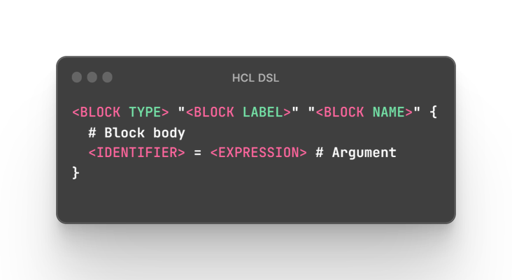

# HCL

`HCL` is a langage developped by [Hashicorp](https://www.hashicorp.com/) and use throught all there tools like [terraform](../../devops/iac/terraform.md).

Furthermore, it is a declarative langage like **YAML** for instance.

# Concepts

There are **two major concepts** in this langage :

- attributes : basic property and its value

```terraform
io_mode = "async"
```

- blocs

```terraform
service "http" "web_proxy"
{
    listen_addr="127.0.0.1:8080"

    process "main" {
        command = ["usr/local/bin/awesome-app", "server"]
    }
    process "mgmt" {
        command = ["usr/local/bin/awesome-app", "mgmt"]
    }
}
```

> :one: Blocks can include both blocks and attributes
>
> :two: Blocks have to math the following syntax :
> 

# Blocks

Here are the most relevant blocks :

- `resource` : element to provision
- `variable` : non-static data, set at runtime
- `data` : data get from provider in order to be used in terraform project
- `output` : data to display at the end of the current execution context
- `local` : data used localy in current context
- `provider` : provider for a cloud / on-premise element provisioner (ex: azurerm_resource_group)
- `terraform` : block dedicated to terraform project configuration

# Accessibility

Every elements are quite easily referable :

```terraform
# Accessible with : var.my_var
variables "my_var" {
    value="myValue"
}

# Accessible with : resource.my_resource.random_prop
resource "resource_type" "my_resource" {
    random_prop = "randomValue"
}

# And so on ...
```
