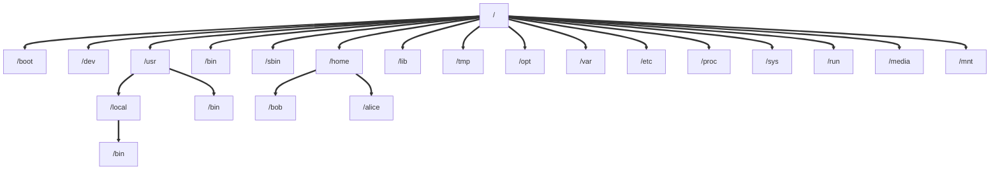

# Linux folders structure

Here's a reminder on linux folders structure and the purpose and each of them.

:pray: Thanks @fireship for his clean explanation [right here](https://www.youtube.com/watch?v=42iQKuQodW4&list=WL&index=1)


# Schema



# Folders

Let's start with the root folder, which is basically `/`.

You can access to it, wherever you are through the basic command : `cd /`

## /bin

Contains binaries or executables that are essential to the entire OS such as `vim`, `ls`, and so on...

## /sbin

Also contains binaries or executables that are essential to the entire OS but only usable by the admin user such as `mount`.

## /lib

Contains common libraries shared to whether /bin and /sbin folder

## /usr

Contains non-essential installed binaries to the entire **and** intended for the end user only.

**/usr** folder is also including a **/bin** and a `/local` folder.

### /local

Contains binaries compiled by the user manually.

&rarr; This allow Linux to make sure you're not getting any conflicts with a package installed by a system package manager.

:bulb: 

- All those binaries are available on the `$PATH` environnment variable 

```bash
which curl
```

- You can also find the location from any binary (not only local) with the following command

```bash
which curl
```

## /etc

Also called `et cetera folder` is used to store editable text config, usually using `.conf` extension.

## /home

Contains a folder for each user registered on the machine and containing specific configurations files.

You can come back on you're **/home/{currentUser}** root with the following command :
```bash
cd ~
```

Or to a specific user folder by explicitly write : 
```bash
cd ~{currentUser}
```

## /boot

Contains the files needed to boot the linux kernel.

## /dev 

Stands for `device files`, allowing you to interface with drivers as they were basic regular files, create an interface, etc.

## /opt

Contains optional or add-on software.

:eyes: Basically, no one need to use it...

## /var

Contains variable files that will change as the OS is being used such as logs or cache files.

## /tmp

Stands for `temporary files` that wont be persisted between reboots in contrats to **/var**

## /proc and /sys

It is an illusionary folder that doesnt really exist on the disk but created on the fly by the linux kernel to keep track of running processes

## /run	

Contains PID files of running processes.

## /media

Contains mountpoint for external drives.

## /mnt

Contains mountpoint for internal drives.